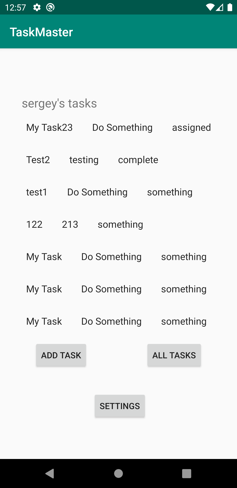
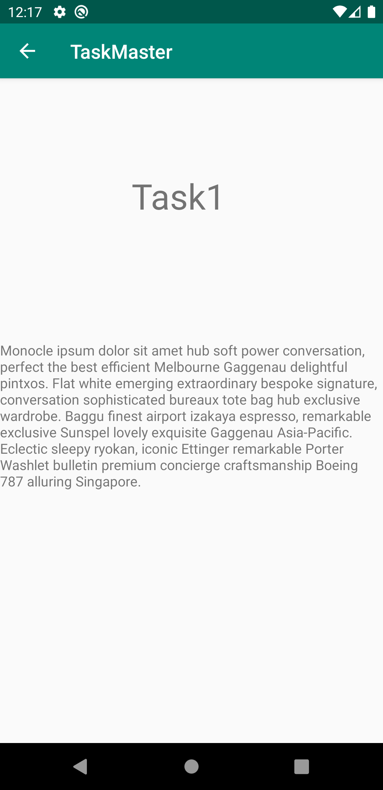

# TASKMASTER App

## Description

Application to add tasks

## Screenshots

Main page of the app

All tasks details

## Daily change log

### 11 February

- created 3 pages(main, AddTaks, Alltasks)
- implemented back button to the parent activity on NavBar for add and allTasks)
- implemented toast pop up as an onClick option for the submit button in the AddTask activity

### 12 February

- created 2 new activities(Settings and task detail)
- implemented shared preferences that I could send the username from the settings page
- implemented sending which task button was clicked on the main page and output on the detail task page.

### 13 February

- added recycled view
- added fragments
- fragments are clickable

### 19 February

- added functionality to add statuses to the tasks using radiobuttons
- deleted extra view in layout for easier styling
- connected fuctionality to DB
- retrieves info from the database

### 20 February

- populated all the tasks from the database to the AllStasks page
- created toast functionality on all Tasks page with the full task description in it

### 21 February

- implemented AWS Amlify
- Modified AddTask and Mainactivity to show contecnt from the cloud DB instead of local DB

### 25 February

- implemented AWS Cognito
- implemented showing the name of the user loged in to output it on the main activity page
- implemented log out function

### 26 February

- implemented AWS S3

### 27 February

- implemented uploading pictures to s3
- outputs the tasks with images from s3

