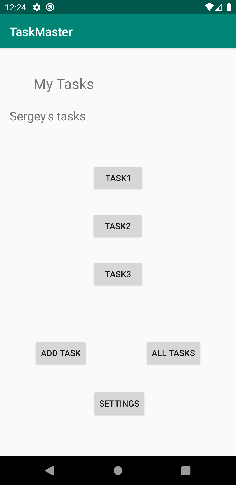

# TASKMASTER App

## Description

Application to add tasks

## Screenshots

Main page of the app

All tasks details

## Daily change log

### 11 February

- created 3 pages(main, AddTaks, Alltasks)
- implemented back button to the parent activity on NavBar for add and allTasks)
- implemented toast pop up as an onClick option for the submit button in the AddTask activity

### 12 February

- created 2 new activities(Settings and task detail)
- implemented shared preferences that I could send the username from the settings page
- implemented sending which task button was clicked on the main page and output on the detail task page.

